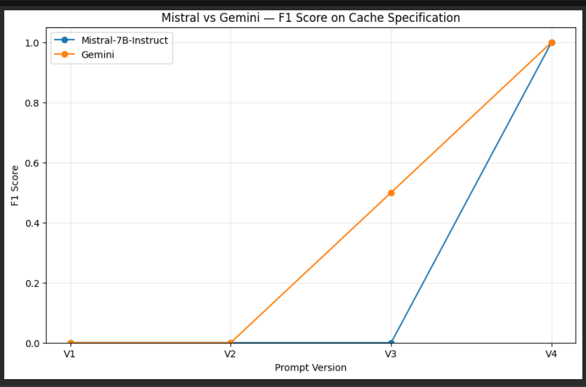
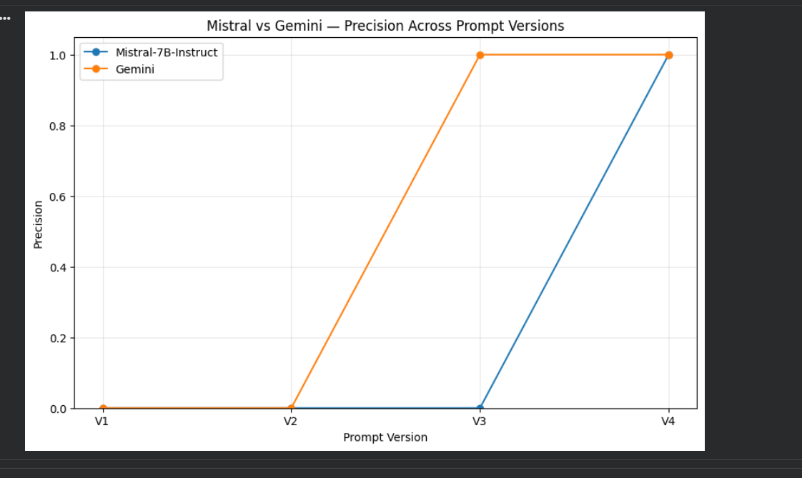
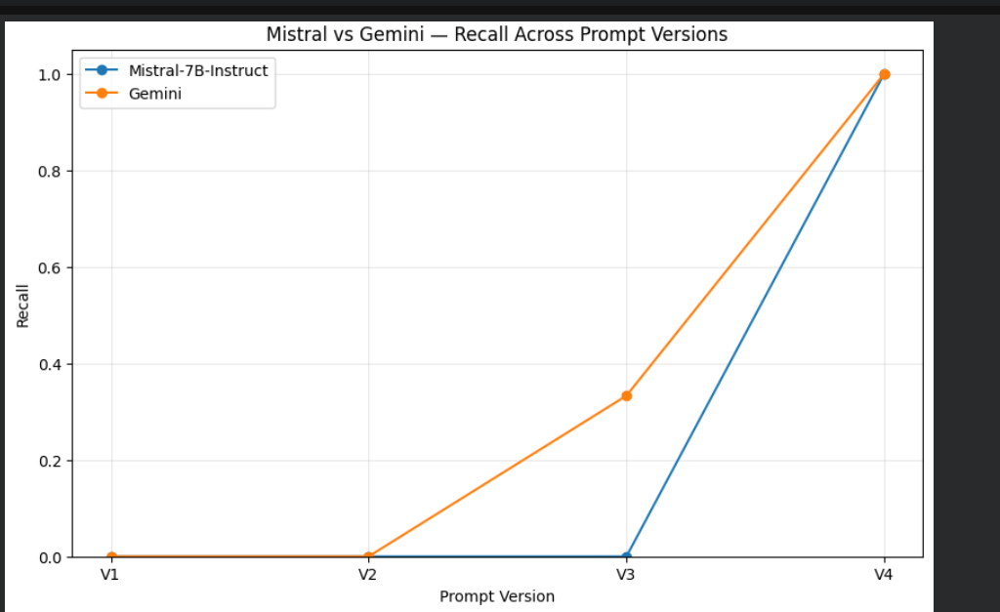
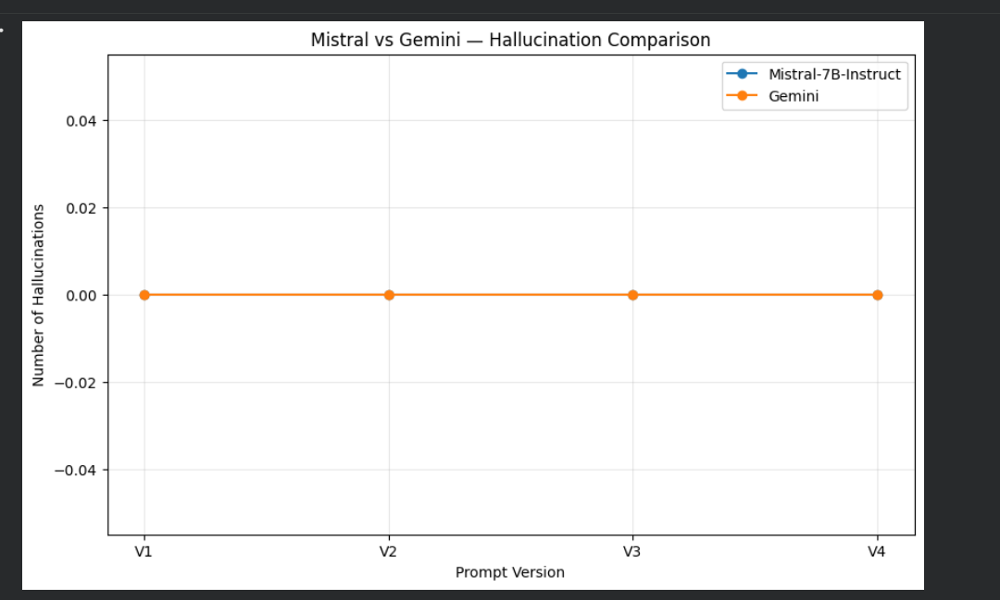

# AI-Assisted Extraction of Architectural Parameters from RISC-V Specifications

**Task:** Given raw text from the RISC-V Privileged Specification, automatically extract
every architectural parameter the spec marks as implementation-specific / optional /
configurable — the kind of detail a compliance engineer would otherwise have to hunt
for by hand across hundreds of pages.

**Approach:** Two LLMs — one open-source, one closed-source — were run through the
*same* four-version prompt-refinement process and scored against a hand-written ground
truth, so the comparison isolates "does open vs. closed source change how much prompt
engineering you need?" rather than just "which model wins."

## Summary

- Built a 4-iteration prompt pipeline (V1 → V4) that took both models from **F1 = 0**
  to **F1 = 1.0** on the target snippet.
- The fix that mattered most wasn't a smarter prompt — it was forcing the model to cite
  **evidence** for every parameter it claimed. That single constraint dropped
  hallucinations to zero across both models.
- Validated with a deliberate **negative test case** (a snippet with zero true
  parameters) to directly measure over-extraction, not just recall.
- Closed-source model reached strong results one prompt version earlier than the
  open-source model — a concrete, measured data point on the capability gap, not a
  guess.

## 1. LLMs Used

| | Open-source | Closed-source |
|---|---|---|
| Model | Mistral-7B-Instruct | Gemini |
| Access | OpenRouter (free tier), OpenAI-compatible API | Google GenAI SDK |
| Parameters | ~7.3B | not disclosed |
| Context length | 32,768 tokens | see model card |
| Sampling | `temperature=0`, `max_tokens=700-1000` | `temperature=0` |

## 2. Prompt Development & Hallucination Handling

Four iterations, each fixing a specific failure of the last:

| Version | Change | Outcome |
|---|---|---|
| **V1** | Bare instruction, no schema | Model invented its own output structure; parameters missed |
| **V2** | Added the keyword list (implementation-specific / optional / may / might / should) | Better recall, still not machine-parseable |
| **V3** | Forced a strict `architectural_parameters:` schema | Schema-compliant, but recall dropped — model got too conservative |
| **V4 (final)** | Kept the strict schema, added "don't invent parameters" + a required `evidence` field quoting the source sentence | **F1 = 1.0 for both models**, zero hallucinations |

**Hallucination control, concretely:** a second snippet (CSR address mapping) was
included as a negative test — it contains **zero** true parameters by design, so
anything a model extracts from it is a hallucination by definition. Both models scored
zero hallucinations on this snippet at V4. In one earlier Gemini retry (after a
transient `503` server error), the model did fabricate a parameter — a useful
reminder that the evidence-field technique reduces hallucination risk substantially
but isn't a hard guarantee.

## 3. Results

### F1 Score — target snippet, across prompt versions

*Both models fail on V1–V2, Gemini partially recovers at V3, and both reach a perfect F1 = 1.0 at V4.*

### Precision — across prompt versions

*Gemini reaches full precision one prompt version earlier (V3) than Mistral-7B-Instruct (V4).*

### Recall — across prompt versions

*Recall follows the same pattern as precision — Gemini partially recovers at V3, both models hit 100% recall at V4.*

### Hallucinations — negative test snippet

*Zero hallucinations for both models in the final systematic evaluation, across every prompt version — this is what motivated the evidence-field constraint (see the fabrication example noted above, from an earlier ad-hoc test, which the final V4 prompt was designed to prevent).*

### Final scores (V4, best prompt)

| Model | Precision | Recall | F1 | Hallucinations |
|---|---|---|---|---|
| Mistral-7B-Instruct | 1.0 | 1.0 | 1.0 | 0 |
| Gemini | 1.0 | 1.0 | 1.0 | 0 |

### Final extracted parameters — [`final_results.yaml`](final_results.yaml)

```yaml
snippet_1:
  source: Privileged Spec 19.3.1
  architectural_parameters:
    - name: cache_capacity
      description: Capacity of a cache in the system.
      type: integer
      constraints: Implementation-specific.
    - name: cache_organization
      description: Organization and structure of a cache.
      type: implementation-defined
      constraints: Implementation-specific.
    - name: cache_block_size
      description: Size of a cache block in memory locations.
      type: integer
      constraints: Must be a contiguous, naturally aligned power-of-two (NAPOT)
        range of memory locations; uniform system-wide in the initial CMO extensions.
snippet_2:
  source: Privileged Spec 2.1
  architectural_parameters: []   # correctly identified as having no configurable parameters
```

## Setup

```
pip install -r requirements.txt
```

The notebook is designed to run in **Google Colab** (it uses `google.colab.userdata`
for API-key secrets and `google.colab.files` for downloads). You'll need free API
keys for OpenRouter (Mistral) and Google AI Studio (Gemini), added as Colab secrets:
`OPENROUTER_API_KEY`, `GEMINI_API_KEY`, `HF_TOKEN`.

## Repo Contents

| File | Contents |
|---|---|
| `riscv_parameter_extraction.ipynb` | Full pipeline: setup, dataset, prompt iterations, both models' experiments, evaluation, graphs |
| `final_results.yaml` | Deliverable 3 — structured extraction results for both snippets |
| `requirements.txt` | Python dependencies |
| `images/` | Graphs referenced above |